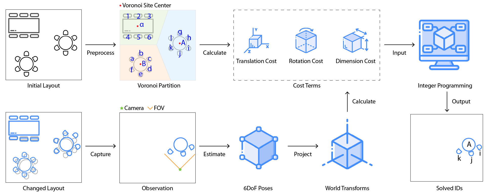
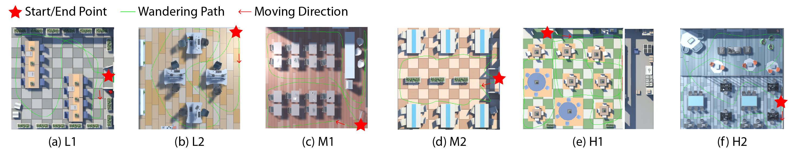
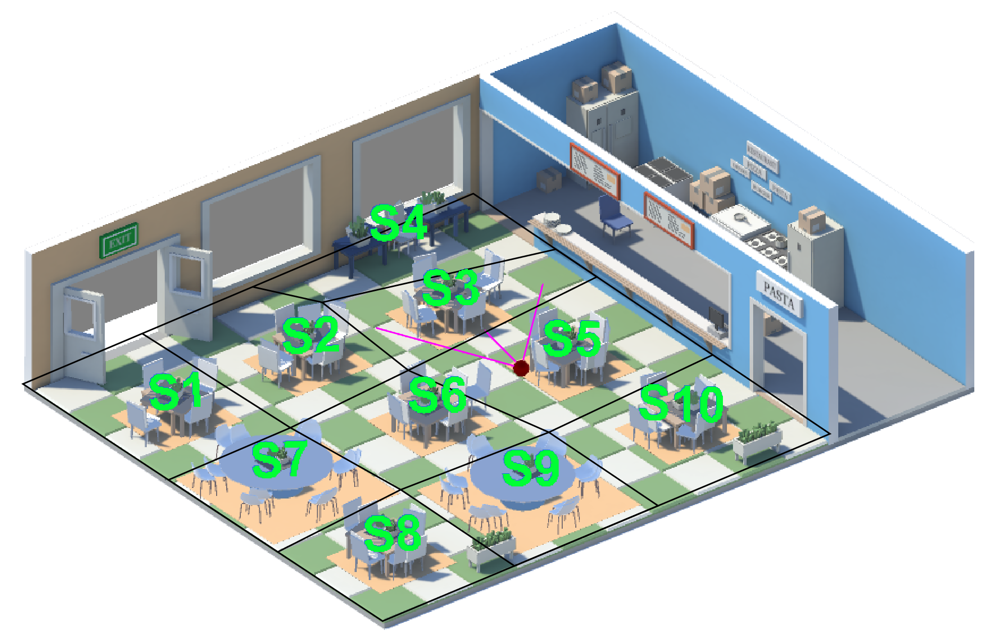

# Enriching AR Interaction

This is the official implementation of the paper **Enriching Physical-Virtual Interaction in AR Gaming by Tracking Identical Real Objects**.

## Development Environment

- Windows 11
- Unity 2020.3.20f1
- Unity Assets
    - We use non-free Unity assets to create experimental scenes. We include them here for reviewing convenience.
    - [Low Poly Restaurant](https://assetstore.unity.com/packages/3d/environments/low-poly-restaurant-147165)
    - [Office 1](https://assetstore.unity.com/packages/3d/props/interior/office-1-205405)

## Approach Overview

## Experimental Scenes

- The following scenes are under `Assets/Scenes/` with the same name. For example, `L1` is corresponding to `L1.unity`.

- The threshold experiment scene is `Assets/Scenes/H1-Threshold.unity`.

## Core Files

The Voronoi map is based on [VoronoiBoardGenerator](https://github.com/KL4USIE/VoronoiBoardGenerator) project.

Our experiments are primarily using the following files under `Assets/Scripts/`:

- `BatchEvaluation.cs`
  
Evaluate our `Object Label Assignment Algorithm` in batch.

- `DataCollector.cs`

Serialize result to CSV file.

- `PoseEstimation.cs`

Core part of the implementation including movement simulation, cost calculation, integer programming, result evaluation, etc.

- `RandomizedEvaluation.cs`

Evaluate our `Object Label Assignment Algorithm` randomly.

> We use [lp_solver](https://lpsolve.sourceforge.net/5.5/index.htm) to solve the integer programming problem. This package is under `Assets/Packages/`.

## References
- KL4USIE's Voronoi Map Generator project
  - https://github.com/KL4USIE/VoronoiBoardGenerator
  - License: MIT
